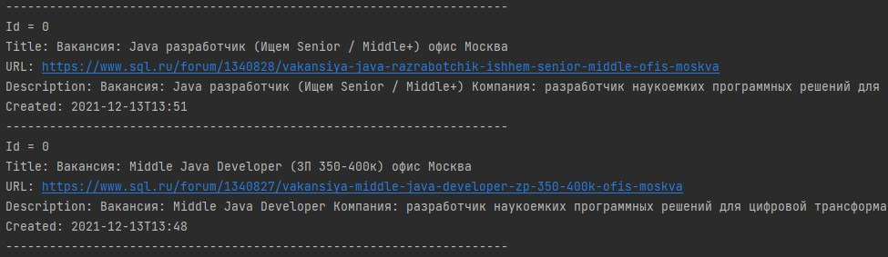

# job4j_grabber

В данном проекте реализован агрегатор вакансий Java разработчиков.

Система запускается по расписанию. Период запуска указывается в 
настройках - app.properties.

В проекте реализован парсинг сайта sql.ru, но можно добавить и другие.
На сайте sql.ru есть раздел job.

Программа считывает все вакансии относящиеся
к Java и записывает их в базу PostgreSQL.

Доступ к интерфейсу организован через REST API.

Расширение.

1. В проект можно добавить новые сайты без изменения кода.

2. В проекте можно сделать параллельный парсинг сайтов.

1. Результат работы программы: найдено две вакансии разработчика Java.
   